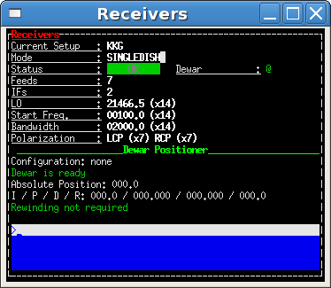

.. _escs:

****
ESCS
****

Avvio di ESCS
=============

.. index:: single: ESCS - Avvio

ESCS deve essere avviato dalla console *escs*  (username XXXX)

Digitare in una shell di terminale::

    $> escsStable

  il prompt deve apparire come nella figura sottostante:
  

.. figure:: images/escs_prompt.png
   :alt: Avvio di ESCS in un terminale 
   :align: center
   

- nella medesima shell digitare::

   $> escs -start

- Apparirà ACS Command Center. Selezionare **localhost(single-machine project)**

Avvio di ACS
------------

- Avviare ACS  cliccando il pulsante ``start`` nel riquadro **ACS suite**
- Cliccare sul  *log tab* ``ACS`` in modo da selezionarlo:
            
.. figure:: images/escs_uandr.png
   :scale: 50 %
   :alt: ESCS up and running
   :align: center

- attendere che nel log tab ACS appaia **ACS is up and running**
  E' necessario, indicativamente, circa un minuto affinché ACS sia 
  *up and running*.

Avvio dei *containers*
----------------------

.. index:: single: ESCS - Avvio container

- individuare il riquadro **Containers**: contiene la lista dei container 
  necessari, tranne che per il *LocalOscillatorsContainer*
  che necessita di una procedura di avvio separata

- Per ciascuno dei container, cliccare sul triangolo verde (è simile al simbolo 
  tasto play di un lettore multimediale)
- Con l'avvio del container, viene aperta la log tab con il nome del container, 
  oppure nel caso in cui tale log tab fosse già aperta, viene messa in evidenza.
- Avviare i container Local Oscillators e quelli della superficie attiva secondo 
  le procedure sotto elencate.
- Verificare che tutti i container siano attivi, controllando 
  :ref:`l'elenco dei container <escs-is-ready>`

.. note::
  
   la finestra **please wait** può essere chiusa senza attendere se il
   container appare nella apposita lista della finestra *Deployment info*, 
   **oppure**  se nel log tab del container appare il messaggio 
   ``ContainerStatusMsg: Ready``
  
  
Container "Local Oscillators"
~~~~~~~~~~~~~~~~~~~~~~~~~~~~~

.. index:: single: ESCS - Avvio container Local Oscillators

- aprire un terminale vuoto e digitare::

   $ lo-ssh

- dopo il login, avviare il container con::
   
   $ acsStartContainer -cpp LocalOscillatorsContainer &

Superficie attiva
~~~~~~~~~~~~~~~~~

La superficie attiva è gestita XXX (aggiornare tutta questa sezione)

Tale comando effettua una connessione ssh verso 
Quindi su una shell digitare i comandi::

  $> escsStable
  $> asContainers

Nell'altra shell digitare il comando::

  $> escsStable
  $> SRTActiveSurfaceGUIClient &

La procudura è completata quando nellla prima shell appaiono i messaggi 
``sectorX done`` dove ``x`` indica il numero del settore
della superficie attiva. Pertanto appariranno 8 messaggi, con x da uno a 8 
(N.B potrebbero non essere in sequenza).

Avvio delle console di ESCS 
------------------------------

.. index:: single: ESCS - Avvio  console

Aprire una shell ed eseguire il comando::

  $> escsConsole    
  
o usare l'icona già presente sul Desktop. 

Shutdown di ESCS 
===================

.. index:: single: ESCS - Shutdown

- Innanzitutto chiudere la console di ESCS. Aprire un terminale dal desktop::

  $> escsConsole --stop

- Su ACS Command Center  nel desktop virtuale ``MANAGER`` chiudere i 
  *containers* cliccando il pulsante di chiusura collettiva
  (pulsante con quadrato nero posizionato sotto la lista dei container). 
  In alternativa è possibile chiudere singolarmente ogni container.

- Chiudere il container degli oscillatori locali:

  #. selezionare la shell in cui si era lanciato il Local Oscillator component
  #. premere il tasto ``enter`` per verificare di avere il controllo del prompt
  #. nel caso in cui non si abbia il controllo del prompt, premere ``ctrl-c``
  #. eseguire il comando::

     $ acsStopContainer LocalOscillatorsContainer

- XXX Chiudere i container relativi alla superficie attiva:
  
  #. selezionare una shell di *nuraghe-as* sul desktop virtuale ``AS`` di nuraghe-mng
  #. premere il tasto ``enter`` per verificare di avere il controllo del prompt
  #. nel caso in cui non si abbia il controllo del prompt, premere ``ctrl-c``
  #. eseguire il comando::

     $ ~/SRTStopActiveSurfaceContainer.sh

- Su ACS Command Center, chiudere l' ``ACS Suite`` premendo il pulsante 
  ``stop`` nell'omonimo riquadro.

.. note:: 

   In certi casi il processo di chiusura di *ACS* può lasciare attivo qualche 
   processo precludendo la chiusura pulita di tutto il sistema. In tal caso 
   eseguire il comando **killACS** e attendere
   il messaggio *Removing ACS_INSTANCE temporary directories ... done*   

Chiusura container ricevitori durante osservazioni
==================================================

Se durante le osservazioni è necessario chiudere uno dei container 
dei ricevitori, è importante assicurarsi che non si chiuda il ricevitore in 
uso. Pertanto verificare nella console di ESCS il ricevitore in uso, che 
nell'esempio nella figura sotto è il ricevitore CCC (XXX figura da cambiare).

Eventualmente, se la strategia osservativa lo consente, cambiare il ricevitore 
in uso. Se ad esempio si vuole arrestare il container del ricevitore CCC e 
questo è in uso, cambiarlo con il comando:: 

   >receiversSetup=CCC

